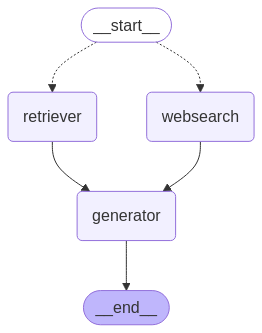

# CloudBrain - Intelligent Agent System

CloudBrain is a sophisticated agentic application which will be built with LangGraph and LangChain, designed to provide intelligent responses through a multi-agent workflow system. It will integrate with CopilotKit for enhanced UI interactions and supports both local and web-based information retrieval. This system will be specifically designed to work with any cloud providers to manage application at scale.

This framework serves as a foundation for building autonomous DevOps systems, enabling the creation of specialized agents that can handle various aspects of infrastructure management, service deployment, and maintenance across different cloud providers and orchestration tools.

## Features

- **Multi-Agent Workflow**: Implements a sophisticated workflow with specialized agents:
  - Router Agent: Determines the best path for query processing
  - Retriever Agent: Handles local document retrieval
  - Searcher Agent: Performs web searches
  - Generator Agent: Creates final responses

- **State Management**: Robust state tracking using CloudBrainState
- **Flexible Search**: Supports both local vector store and web search capabilities
- **Real-time Streaming**: WebSocket support for real-time updates
- **Error Handling**: Comprehensive error handling and logging
- **API Integration**: FastAPI-based REST API with CopilotKit compatibility
- **Terraform Integration**: Specialized ingestion and retrieval of Terraform modules
- **Extensible Architecture**: Designed for building custom DevOps automation agents
- **Direct Python Integration**: Use the agent system directly in your Python code

- **Smart Agent Team**: A crew of specialized AI agents working together:
  - Router Agent: The traffic controller, directing queries to the right expert
  - Retriever Agent: Your local knowledge base guru
  - Searcher Agent: The web research specialist
  - Generator Agent: The creative one who puts it all together

- **State Management**: Keeps track of everything (because we all need a good memory!)
- **Search Superpowers**: Find stuff locally or on the web - whatever works best
- **Real-time Updates**: Watch the magic happen live through WebSocket
- **Error Handling**: Because things happen, and we handle them gracefully
- **API Integration**: Plays nicely with CopilotKit for a smooth UI experience
- **Terraform Integration**: Your infrastructure-as-code best friend
- **Extensible Architecture**: Build your own dream team of DevOps agents

## Architecture

### Core Components

1. **Workflow Manager**: The project manager of our AI team
   - Coordinates the agents
   - Keeps track of what's happening
   - Makes sure everything runs smoothly
   - Shows you what's going on

2. **State Management**: Our memory system
   - Remembers what you asked
   - Keeps track of documents
   - Stores research findings
   - Maintains conversation context

3. **Agent System**: The specialists
   - Router Agent: Traffic control
   - Retriever Agent: Local search expert
   - Searcher Agent: Web research pro
   - Generator Agent: Creative problem solver

4. **Terraform Ingestion System**: Our infrastructure expert
   - Reads Terraform repos
   - Processes modules
   - Makes everything searchable
   - Helps generate infrastructure code

### Workflow Diagram

The CloudBrain system follows a sophisticated workflow that can be visualized using the `cloudbrain_graph.png` diagram. This diagram shows how the different agents interact with each other and how information flows through the system.



The workflow includes:
- Initial query processing by the Router Agent
- Document retrieval by the Retriever Agent
- Web searches by the Searcher Agent
- Response generation by the Generator Agent
- State transitions between different stages of processing
- Human-in-the-loop feedback mechanisms

You can generate this diagram programmatically using the `draw_workflow_graph()` method:

```python
from cloudbrain.agent import ChiefEditorAgent

# Create an agent
agent = ChiefEditorAgent({"query": "example query"})

# Draw the workflow graph
agent.draw_workflow_graph("cloudbrain_graph.png")
```

### API Endpoints

- `POST /api/copilotkit`: Chat with your AI team
- `GET /health`: Check if everyone's feeling good

## How It All Works 🏗️

### The Core Team

1. **Workflow Manager**: The project manager of our AI team
   - Coordinates the agents
   - Keeps track of what's happening
   - Makes sure everything runs smoothly
   - Shows you what's going on

2. **State Management**: Our memory system
   - Remembers what you asked
   - Keeps track of documents
   - Stores research findings
   - Maintains conversation context

3. **Agent System**: The specialists
   - Router Agent: Traffic control
   - Retriever Agent: Local search expert
   - Searcher Agent: Web research pro
   - Generator Agent: Creative problem solver

4. **Terraform Ingestion System**: Our infrastructure expert
   - Reads Terraform repos
   - Processes modules
   - Makes everything searchable
   - Helps generate infrastructure code

## Let's Get Started! 🚀

### What You'll Need

- Python 3.12+ (because we're modern!)
- Poetry (for dependency management)
- Docker (optional, but recommended)
- Git (for grabbing Terraform repos)
- **OpenAI API Key** (required for LLM functionality)
- **Tavily API Key** (required for web search functionality)

### Setting Things Up

1. Clone this bad boy:
   ```bash
   git clone [git@github.com:structbinary/cloudbrain.git]
   ```

2. Install the dependencies:
   ```bash
   poetry install
   ```

3. Set up your environment:
   ```bash
   cp .env.example .env
   # Time to customize your .env file!
   ```

4. Add your API keys to the .env file:
   ```bash
   # Add these to your .env file
   OPENAI_API_KEY=your_openai_api_key_here
   TAVILY_API_KEY=your_tavily_api_key_here
   ```

5. Set up your Terraform repos:
   ```bash
   # Create a terraform-repository.url file
   echo "https://github.com/example/terraform-modules.git" > terraform-repository.url
   ```

6. Run the ingestion process:
   ```bash
   poetry run python ingestion.py
   ```

### Running the Show

#### Local Development
```bash
poetry run python server.py
```

#### Docker Style
```bash
docker build -t cloudbrain .
docker run -p 8000:8000 cloudbrain
```

### Using the Agent Directly in Python

Besides using the API, you can also use CloudBrain directly in your Python code. This is great for integrating the agent system into your own applications or scripts.

Here's how to use the `agent.py` module:

```python
from cloudbrain.agent import ChiefEditorAgent, CloudBrainState
import asyncio

# Define your task
task = {
    "query": "How do I create an AWS S3 bucket with versioning enabled?",
    "max_iterations": 3,
    "verbose": True
}

# Create the agent
agent = ChiefEditorAgent(task)

# Initialize the workflow
workflow = agent.init_workflow()

# Visualize the workflow (optional)
agent.draw_workflow_graph("my_workflow.png")

# Run the agent
async def main():
    result = await agent.run()
    print("Task completed:", result)

# Run the async function
asyncio.run(main())
```

This approach gives you more control over the agent system and allows you to:
- Customize the task parameters
- Visualize the workflow graph
- Integrate with your existing Python code
- Access the agent's state directly
- Extend the agent with custom functionality

### Try It Out!

Here's a quick test to make sure everything's working:

```bash
curl -X POST http://localhost:8000/api/copilotkit \
-H "Content-Type: application/json" \
-d '{
  "variables": {
    "data": {
      "messages": [
        {
          "textMessage": {
            "role": "user",
            "content": "How do I create an AWS S3 bucket with versioning enabled?",
            "name": null
          }
        }
      ],
      "threadId": "test-thread-123"
    }
  }
}'
```

## Configuration Options ⚙️

You can customize your setup through:
- Environment variables
- Config files in `graph/config/`
- LLM settings in `graph/llm/`
- Search settings in `graph/tools/`
- Terraform repo URLs in `terraform-repository.url`

## Project Structure 📁

```
cloudbrain/
├── graph/
│   ├── agents/      # Our AI team members
│   ├── config/      # Configuration files
│   ├── llm/         # LLM settings
│   ├── tools/       # Special tools
│   ├── utils/       # Helper functions
│   ├── state.py     # Memory management
│   └── workflow_manager.py
├── server.py        # The main server
├── ingestion.py     # Terraform processor
├── agent.py         # Agent definitions
├── terraform-repository.url  # Repo list
└── Dockerfile       # Container config
```

## The Terraform Ingestion Process 🔄

Our `ingestion.py` script is like a smart librarian that:

1. **Reads Repo URLs**: Checks out what Terraform repos to process
2. **Clones Repos**: Downloads the modules we need
3. **Processes Files**: Handles `.tf`, `.tfvars`, `.yaml`, and `.yml` files
4. **Chunks Documents**: Breaks down code into digestible pieces
5. **Stores in Vector DB**: Saves everything in our Chroma database
6. **Enables Search**: Makes it easy to find relevant code

This helps our agents:
- Understand Terraform patterns
- Find relevant code examples
- Generate smart recommendations
- Share best practices

## Building Your DevOps Dream Team 🤝

CloudBrain is perfect for building your own DevOps automation platform. Here's what you can do:

### Infrastructure Management
- **Cloud Orchestration Agents**:
  - Terraform Agent: Infrastructure wizard
  - Terragrunt Agent: Environment specialist
  - Pulumi Agent: Code-first infrastructure
  - CloudFormation Agent: AWS expert

### Service Deployment
- **Deployment Agents**:
  - Kubernetes Agent: Container maestro
  - Helm Agent: Package manager
  - ArgoCD Agent: GitOps guru
  - Service Mesh Agent: Traffic controller

### Operations and Maintenance
- **Monitoring Agents**:
  - Metrics Agent: Performance tracker
  - Logging Agent: Log analyzer
  - Tracing Agent: Debug helper
  - Security Agent: Security guard

### Example: Building Your Own Agent

Here's how to create a new DevOps agent:

```python
from typing import Dict, Any
from .base import BaseAgent
from .state import CloudBrainState

class CustomDevOpsAgent(BaseAgent):
    def __init__(self):
        super().__init__()
        # Set up your tools
        
    async def execute(self, state: CloudBrainState) -> CloudBrainState:
        # Do your magic here
        return state
```


## Contributing 🤝

Want to help make CloudBrain even better? Here's how:

1. Fork the repository
2. Create your feature branch
3. Make your changes
4. Push to your branch
5. Create a Pull Request

## Acknowledgments 🙏

Thanks to all the amazing tools that make this possible:
- LangChain
- LangGraph
- CopilotKit
- FastAPI
- Terraform
